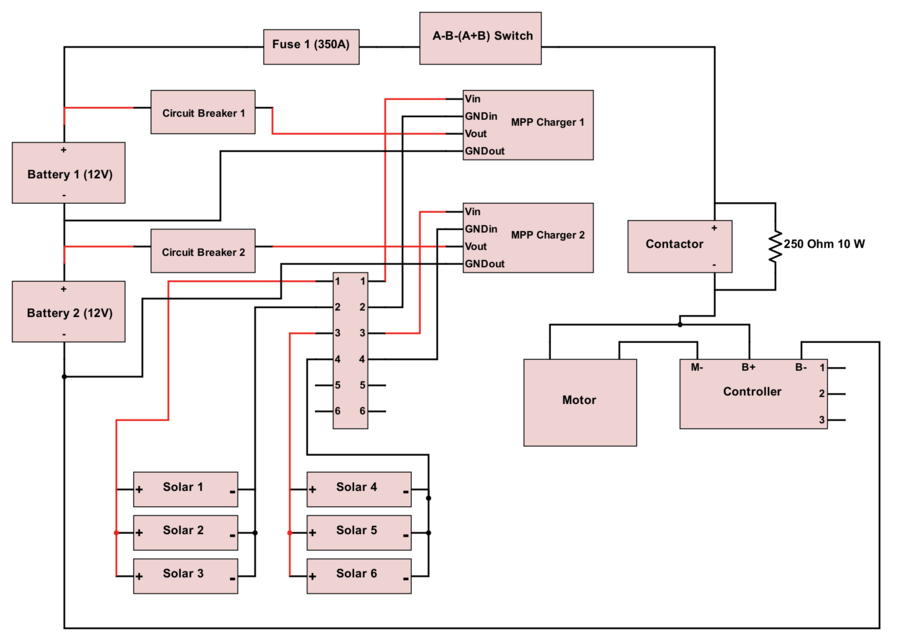
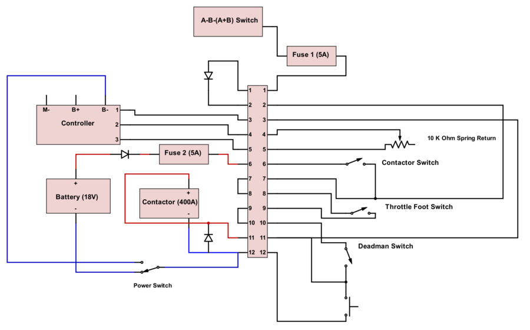

## What is Solar Boat?

Solar Boat is an organization at Palos Verdes Peninsula High School that participates in the [Solar Cup](http://www.mwdh2o.com/inthecommunity/education-programs/Pages/Solar-Cup.aspx), the largest solar-powered boat race in the world.
The competition is sponsored by Metropolitan Water District and consists of two events: sprint and endurance.
Teams at participating schools have 9 months to construct a working solar-powered boat, provide two reports detailing the boat's schematics, and pass inspection to be able to compete.
The competition itself takes place during May at Lake Skinner and goes on for 3 days.

## How does it work?
In order to propel the boat, we utilized a motor mounted to the the boat which rotated a three-bladed propeller. The motor is powered by two twelve volt Odyssey Extreme PC 11000 batteries. Six solar panels are used to charge the batteries in the boat. The motor has several safety switches implemented so that the boat does not turn on by mistake.

## My History With the Program
I was in the organization for four years. During that time, I went from a regular member to battery manager to co-president. My job as battery manager was to test and maintain the batteries used for the competition. This position taught me how to use a load tester, a device used to simulate real load conditions, to see how long the battery could remain at a working voltage level to power the motor. I picked up on this relatively quickly and was able to easily teach someone else how to manage the system. 

As co-president, my job changed from doing the labor to teaching others how to do it. I taught the newer members how to recognize tools, like screwdrivers, load testers, and multimeters, and how to use them. Since we had new advisors that year, I had to step up to the plate and fill out all the necessary paperwork, such as permission slips and activity clearance forms, in order to be able to participate in the various workshops and the competition itself. I became much more organized and disciplined as a result. 

## Awards

### 2018
1st Place in Technical Reports in the Central and Bay Region 
2nd Place in the Endurance Race in the Central and Bay Region 

### 2016
1st Place in Technical Reports in the Central and Bay Region 
2nd Place in the Endurance Race in the Central and Bay Region 
1st Place in the Sprint Race in the Central and Bay Region 

## Reports 

I oversaw the process of writing experimental reports. I also made circuit diagrams, center of gravity and buoyancy calculations, and edited the report to make sure there were not any mistakes.

[Electrical Report 2018](Copy%20of%202018%20Elec%20Report.pdf) 
[Drive Train Report 2018](Copy%20of%20Drive%20Train%20Report.pdf)

I made the following diagrams for the electrical report below using the Digi-Key online circuit maker.

### Solar Boat Power Circuit

 
### Solar Boat Control Circuit

 

### Power Circuit

 
### Control Circuit

 

## Pictures (I really need help for these captions, they just seem bad, I don’t really know how descriptive to be and what is considered an acceptable length for a caption)
Building the hull for the boat. The clamps in the picture were meant to hold the sides together to give time for the epoxy we applied on those areas to cure. I was drilling a screw into the hull to provide more reinforcement to the overall structure. All of the materials seen were provided at a boat-building workshop sponsored by the Metropolitan Water District.
  
Preparing the boat for the endurance event. The six solar panels on the boat were from Sacred Solar and the nominal power for each unit is 60 watts. With the batteries fully charged, this allowed for one and a half hours of run time at a speed of 15 miles per hour.  
 
Going through safety checks at the dock before racing in the endurance event.  
 
Driving around one of the buoys on the endurance race course. The boat was steered using a push-pull rod which connected the lever to the rudder. 
 

